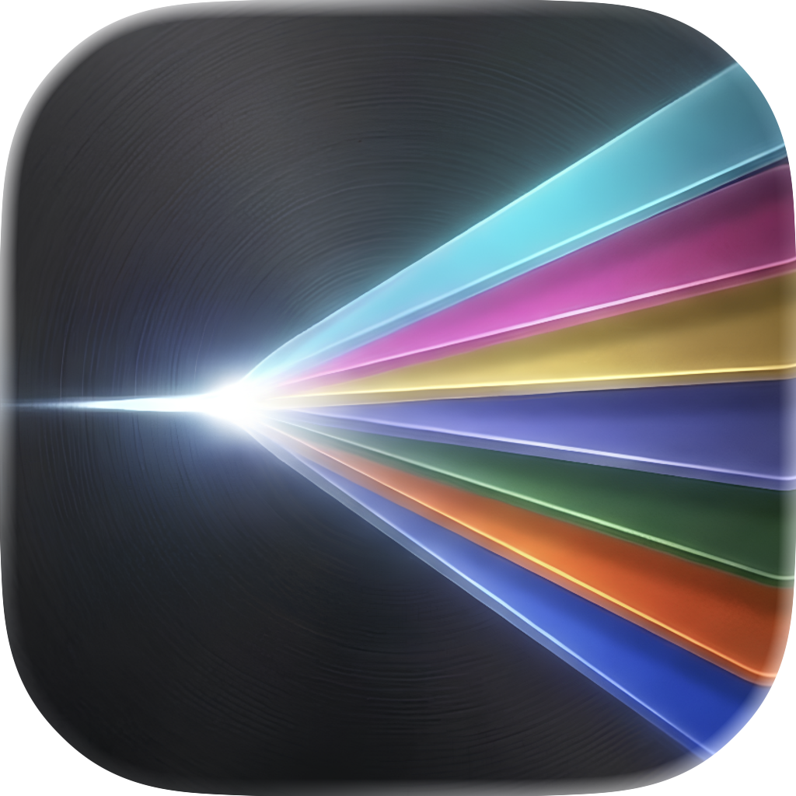
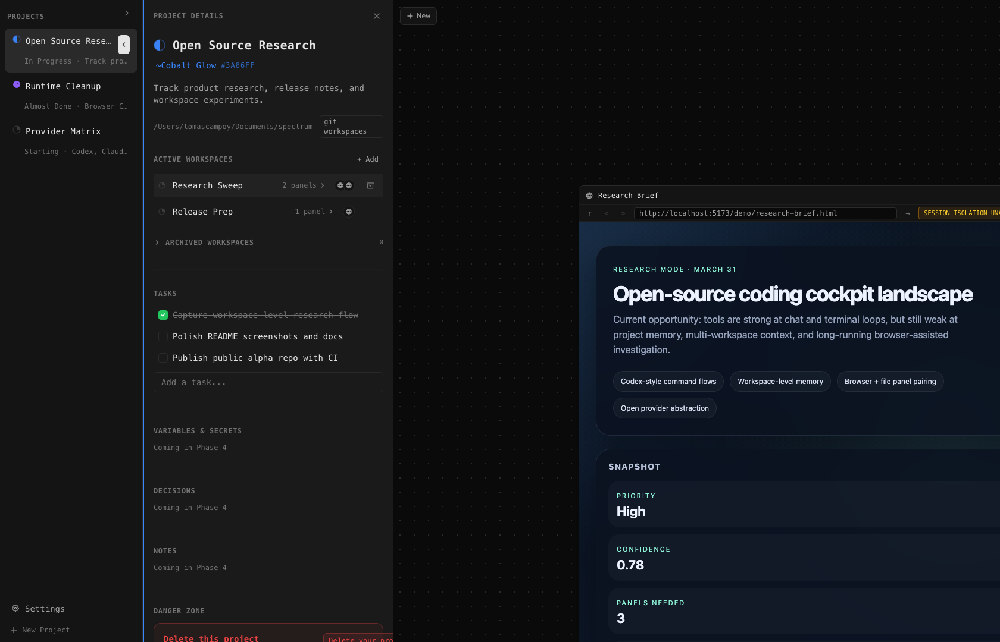
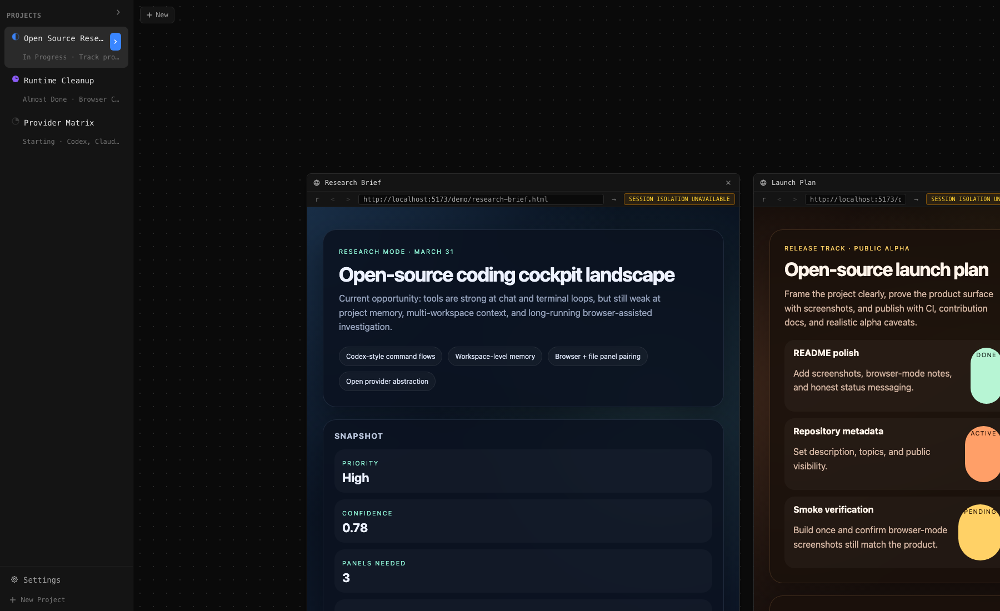

# Spectrum

<p align="center">
  
</p>

Spectrum is a desktop project cockpit for coding work. It combines a dense Electron UI, project dashboards, canvas-style workspaces, terminals, browser panels, file editing, and chat-oriented workflows into one app.

It is being built in public. The app is already useful for real exploration and project tracking, but it is still early, opinionated, and incomplete by design.

## Screenshots

### Project dashboard



### Research workspace in browser mode



Screenshots above were captured from `npm run dev:browser` with the runtime power mode set to `High`.

## What Spectrum Is For

- Keeping project context close to execution
- Switching between multiple workspaces without losing the thread
- Pairing browser research, files, terminals, and agent sessions inside one project surface
- Treating the project dashboard as memory, not as a separate notes app

## What Exists Today

- Project dashboard backed by SQLite
- Project metadata and task tracking
- Multi-workspace canvas model
- Terminal, browser, file, and T3Code-oriented panel flows
- Dense desktop-first UI built with Electron, React, Zustand, and Tailwind CSS 4
- Browser-only development mode for full-stack testing without launching Electron

## Status

- Early alpha
- Build in public
- Best suited today for trying ideas, following progress, and contributing
- Not yet polished enough to promise stability across every workflow

## Repository Notes

- The product source lives under `src/`
- External dependencies used for development or reference are tracked as submodules under `resources/`
- Generated packaging/runtime assets are created locally and are not committed
- `artifacts/`, `dist/`, `out/`, `build/t3code-runtime/`, and `.dev-server.cjs` are local outputs
- Large implementation-reference snapshots have been removed from source control to keep the public repo focused on the product itself

## Why It Exists

Most coding tools collapse everything into a single chat or terminal. Spectrum is aimed at the project layer around that work: tasks, workspace layout, repo context, lightweight memory, and multiple execution surfaces inside the same desktop app.

## Near-Term Priorities

- Git worktrees
- UI overhaul, including favicons and richer project visuals
- Chat panel improvements so it feels closer to Codex
- Performance improvements
- Customizable panels and better panel creation flows
- OpenCode as a provider
- Model selection

## Coming Soon

- App-wide search
- Getting repo icons working properly
- UI improvements across the project dashboard, canvas, and navigation surfaces
- Project variables
- A CLI for managing the project page as the centralized source for architecture decisions, notes, and other context future agents should read
- A revamp of the tasks section, potentially making the source of truth the repo's `TODO.md`

## Stack

- Electron
- React 19
- Tailwind CSS 4
- Zustand
- SQLite via `better-sqlite3`
- TypeScript

## Development

Requirements:

- Node.js 20+
- npm
- `git` with submodule support
- macOS is the primary development target right now
- Bun is recommended if you want the embedded T3Code runtime to work locally

Clone the repo:

```bash
git clone --recurse-submodules https://github.com/tomcrojo/spectrum.git
cd spectrum
```

If you already cloned it without submodules:

```bash
git submodule update --init --recursive
```

Current submodules:

- `resources/t3code`

Install and start the Electron app:

```bash
npm install
npm run dev
```

Run the full browser-mode stack instead of Electron:

```bash
npm run dev:browser
```

Build production bundles:

```bash
npm run build
npm run dist:mac
```

Important runtime note:

`ELECTRON_RUN_AS_NODE` must be unset when launching Electron. The `npm run dev` script already handles this.

## Browser Mode

`npm run dev:browser` starts the renderer at `http://localhost:5173` and a standalone backend over WebSocket. This is the easiest way to inspect the app in a browser, capture screenshots, and test browser/terminal/file flows without launching the Electron shell.

## Project Layout

- `src/main`: Electron main process, IPC, SQLite, runtime managers
- `src/preload`: renderer bridge
- `src/renderer`: React UI and browser-mode assets
- `src/shared`: cross-process types and IPC channel definitions
- `resources`: helper projects and runtime helpers used during development

## Known Limitations

- Spectrum is still an alpha and workflow details may change quickly
- macOS is the primary supported environment today
- The embedded T3Code workflow depends on the `resources/t3code` submodule and Bun
- DMG builds are currently intended for testing and are not notarized yet
- Some workflows still depend on development-time helper tooling and local packaging steps

## Third-Party Code

Spectrum uses a small mix of local helpers and git submodules for development-time workflows. See [THIRD_PARTY.md](./THIRD_PARTY.md) for the current inventory and upstream links.

## Acknowledgements

Spectrum stands on the shoulders of projects that shaped its direction. Huge thanks to:

- [T3Code](https://github.com/pingdotgg/t3code)
- [IDX0](https://github.com/galz10/IDX0)
- [cmux](https://github.com/manaflow-ai/cmux)

Their ideas, tooling, and implementation patterns helped clarify where Spectrum should be opinionated and where it should stay open.

## Contributing

Issues and PRs are welcome, especially around bugs, regressions, performance, Electron security hardening, workspace UX, and documentation gaps.

See [CONTRIBUTING.md](./CONTRIBUTING.md) for the current workflow.

## Release Process

For public alpha drops, use the checklist in [docs/release-checklist.md](./docs/release-checklist.md).

For announcement copy, start from [docs/announcement-draft.md](./docs/announcement-draft.md).

## License

MIT. See [LICENSE](./LICENSE).
